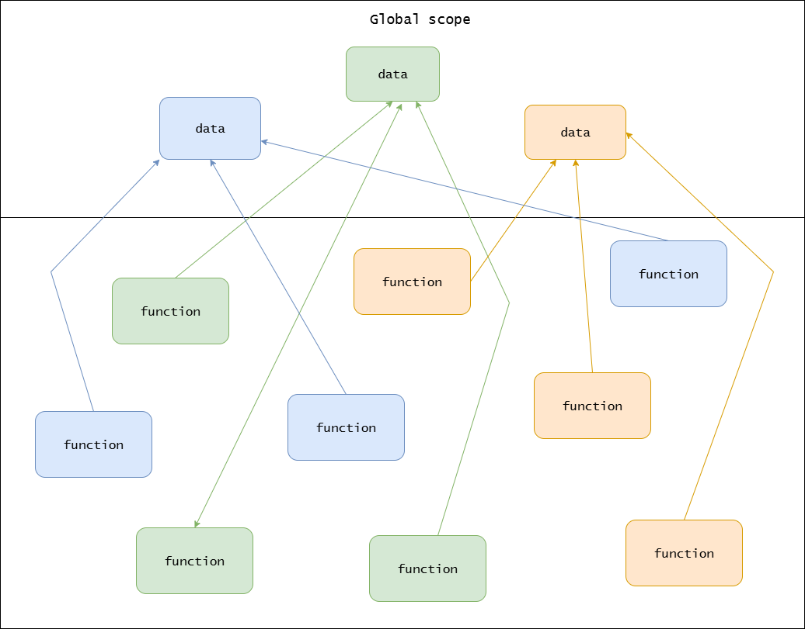
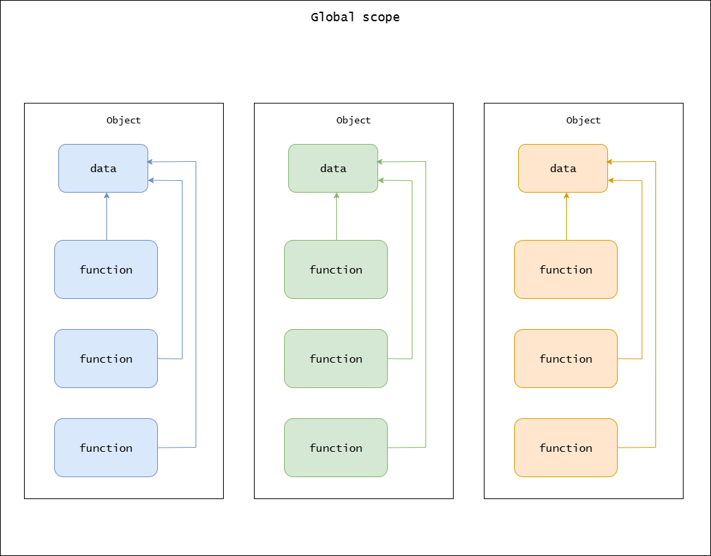
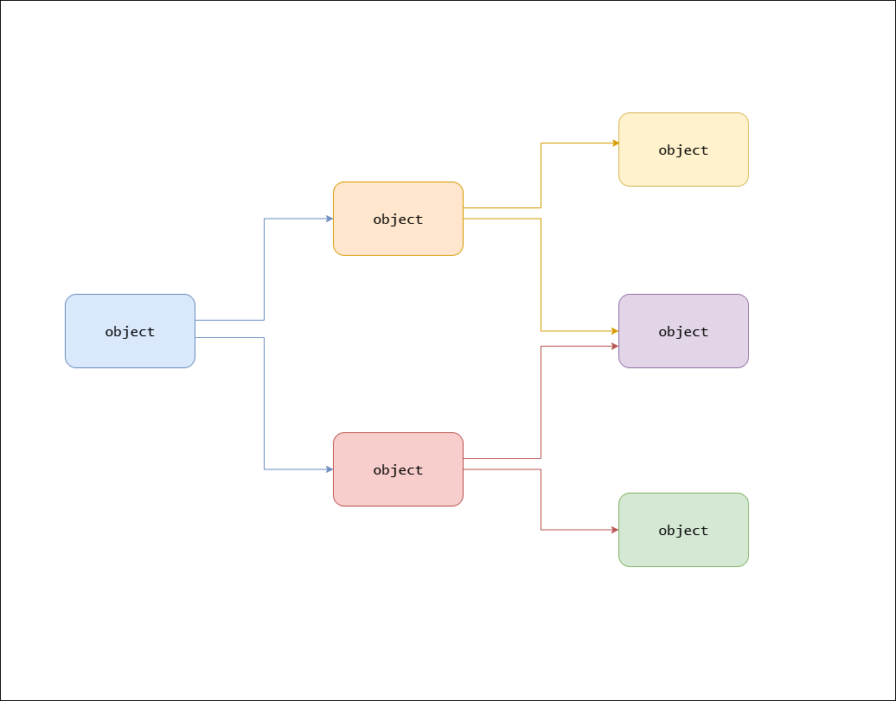
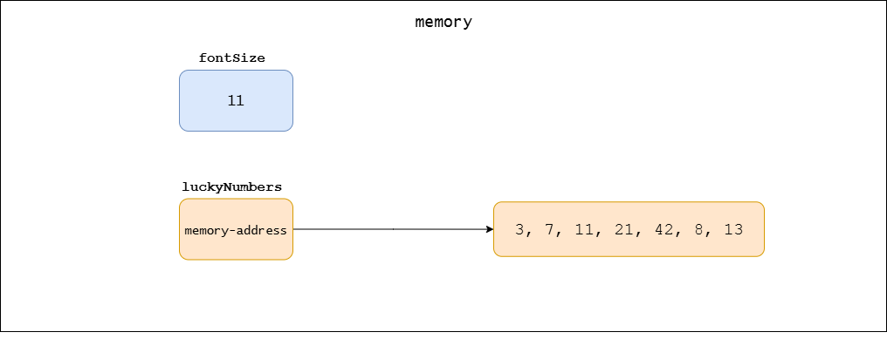
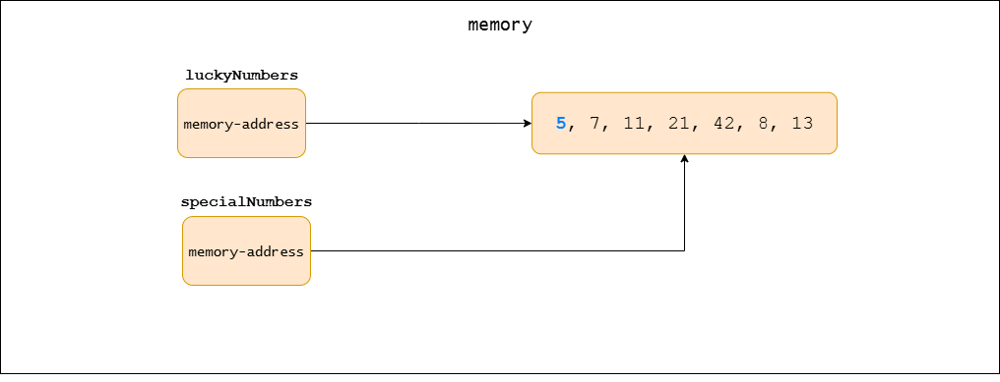
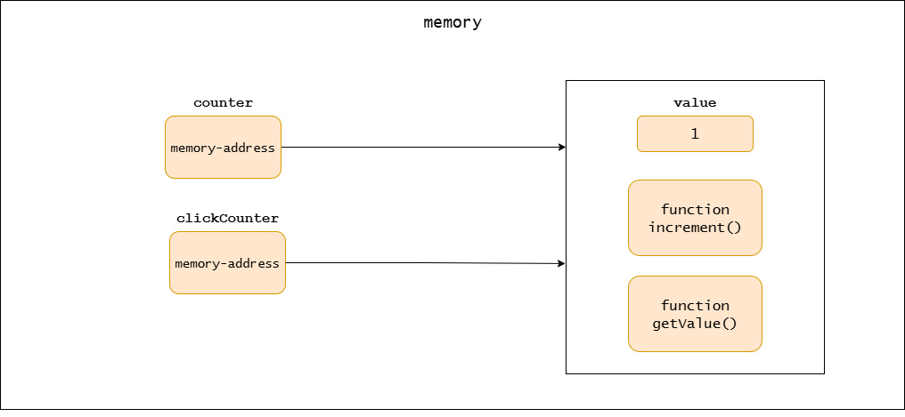

# Objects: united data and operations

Programmers use different methods to write software. These methods, known as programming paradigms, define various ways of thinking about problems and organizing solutions in code.

One of the most widely used paradigms today is object-oriented programming (OOP). However, before OOP became popular, most software was built using the procedural programming paradigm, a style based on step-by-step instructions and the use of functions to organize code.

Although OOP dominates many areas of modern software development, procedural programming remains highly relevant. In fact, OOP did not replace procedural programming; instead, it emerged as a natural extension of it. When procedural code becomes complex, hard to maintain, or prone to errors, OOP provides tools that help manage that complexity.

It is also important to recognize that object-oriented programming builds on the foundations of procedural programming. Objects still rely on functions (called methods when tied to an object), and procedural thinking is embedded within OOP.

While many other paradigms exist, such as functional programming and declarative programming, procedural and object-oriented programming remain the most widely used and closely related. For this reason, they are often studied together, especially by beginners moving from simpler scripts to larger, more complex software systems.

## Procedural programming

In procedural programming, functions are the main building blocks of a program. A function groups a specific piece of logic into a unit. Data can be passed into a function through parameters, or the function may work with shared global variables.

Functions are reusable chunks of logic. Instead of repeating the same code in multiple places, you define the logic once inside a function and call it whenever you need that behavior. This makes programs shorter, easier to read, and easier to modify.

At its core, procedural programming treats a program as a task to be executed. The programmer’s goal is to break that task into smaller sub-tasks, and then into even smaller ones, until each piece can be expressed as a function. Once all the sub-tasks are implemented, they are combined to form a complete working program.

Functions also provide a degree of modularity. You can often write or test a function in isolation, and in many cases, you can change its internal implementation without affecting the rest of the code, as long as the function’s inputs and outputs remain the same.

Procedural programming has limitations that make it less suitable for writing complex programs. One of the biggest challenges is data management. In many procedural programs, data is stored in global variables, and higher-level functions often communicate by reading and modifying these shared variables. As the program grows, keeping track of which function modifies which variable and ensuring that changes are intentional becomes a daunting task. This makes debugging especially difficult, since a single unintended modification can introduce subtle and hard-to-trace errors.

<figure>
    
    <figcaption><em>Fig. 1: Global Scope</em></figcaption>
    <br><br>
</figure>

Procedural programs typically have only a global scope where all functions and data reside. While functions do provide local scope, it only exists temporarily while the function is executing. Once the function finishes, its local data is erased from memory. This means functions are not designed to maintain persistent state or provide self-contained sub-scopes for long-lived data. Instead, they serve mainly as isolated units of logic with temporary working memory.

For this reason, procedural programs often suffer from limited modularity. In classic procedural languages, such as C or early BASIC, functions are the primary modular units. Modern procedural-friendly languages like Python and JavaScript introduced file-level modularity and scoping, which makes structuring procedural code easier. For example, each file in these languages has its own scope, and in practice, a module behaves like a singleton object that can hold both functions and data. While this solves some of the modularity problems of older procedural languages, it still does not provide the richer modularity that object-oriented programming offers.

Modularity is closely tied to code reusability. In procedural programming, small utility functions, functions that perform one specific task, are relatively easy to reuse across projects. These are often packaged into libraries and shared widely (e.g., math libraries, string utilities). However, higher-level functions that implement business logic are harder to reuse, especially in other projects. They often rely on global variables or implicit program-wide state, and even if they don’t directly use globals, they may depend on different functions that do. To reuse such functions, you would need to carefully extract not only the function itself but also all the hidden dependencies around it, which quickly becomes tedious and error-prone. In practice, this often makes the effort of extraction more trouble than it’s worth.

Having strong mechanisms for modularity is crucial for developing complex projects, especially when multiple teams are involved. In large systems, each team is often responsible for a specific feature or component, but procedural programming makes this hard because it relies heavily on a single global scope or broad shared scopes. Without clear boundaries, teams risk stepping on each other’s toes, for example, two files might define a function or global variable with the same name, leading to conflicts, overwritten data, or unpredictable behavior. Good modularity prevents these kinds of issues by giving teams well-defined spaces for their code. It also makes collaboration easier, supports code reuse, and allows independent pieces to be integrated into the larger system with fewer risks.

Maintaining a procedural program presents another challenge. As requirements change, programmers often need to add new code, update existing logic, or remove old features. The common approach is to search for an existing function and modify it to meet the new requirement. Sometimes this is necessary, but other times it’s just the convenient option. The problem is that as functions are repeatedly modified, they tend to grow larger and more complex. Over time, this makes them harder to test, more difficult to debug, and more fragile to maintain, since even small changes can introduce unintended side effects or break functionality that previously worked.

Because of these challenges, many large procedural projects have faced difficulties or even failed due to maintenance issues. However, procedural programming remains quite useful for smaller or medium-sized programs, especially when using modern languages that support modules and better scoping.

However, as software grows, its reliance on global state, its limited modularity, the difficulty of reusing higher-level logic, and the risk of breaking existing code when adding new features all become serious obstacles. These shortcomings were a major motivation for the rise of object-oriented programming, which builds on procedural foundations while introducing stronger concepts such as encapsulation, persistent state within objects, inheritance, composition, polymorphism, and modular designs that support extension without modification. These features make OOP better suited for handling the complexity of large, evolving systems.

## Object-Oriented Programming

In object-oriented programming (OOP), the primary building blocks of a program are objects. An object is a unit that groups data and the functions that operate on that data.

But what does it mean to group data and functions together?

In procedural programming, data and the functions that act on it are separated. All functions and global data exist in the global scope, and while not every function operates on every piece of data, they all technically share the same scope.

For example, some data might be used by one set of functions, while a different set uses other data. Yet, because they all live in the same global scope, conflicts and unintended interactions are common.

OOP solves this by putting data and the functions that work with it into self-contained units called objects. Each object creates a scoped-like environment for both its data and its functions. As a result, the data and methods are no longer part of the global or outer scope and cannot be accessed directly from the outer scope. This prevents them from polluting the global scope and eliminates many of the problems caused by a shared global state.

In other words, “grouping data and functions”  essentially means creating a dedicated, scoped-like environment for them, one that is isolated from the outer scope.

<figure>
    
    <figcaption><em>Fig. 2: Objects in global scope</em></figcaption>
    <br><br>
</figure>

This ability to create an isolated, scoped-like environment for data that must persist beyond a single function call is the fundamental concept of OOP. By keeping related data and behavior together, objects become both non-global and self-contained units, which provide stronger modularity and reduce accidental interference between different parts of a program.

The data and functions inside an object don’t pollute outer scopes because they cannot be accessed directly; they are only accessible through a reference to the object.

So, how does an object look in code? Here are some examples:

A `weather` object:

```
weather = {

    temperature = 72
    condition = "sunny"
   
    function temperatureLevel() {
        if (temperature < 50)
            return "cold"
        if (temperature < 75)
            return "mild"
        else
            return "hot";
    }
   
    function describe() {
        return temperature + "°F and " + condition
    }

}
```

If you look inside the outermost curly braces, you will see two variables holding data and two functions. The curly braces define an object, and as explained earlier, an object groups data together with the functions that operate on that data, that is exactly what happens here: the functions use the data stored in the object’s variables to perform operations. Notice that we don’t need to pass the data to these functions explicitly, because they belong to the object, they can directly access the object’s internal data. This is like functions accessing global variables in the global scope, but here the scope is limited to the object itself.

| NOTE: |
| :--- |
| I mentioned that inside an object, methods can access its data directly without needing the data to be passed as parameters. If you are familiar with how many programming languages implement objects, you might wonder whether the data is truly “accessed directly.” Technically, the language runtime passes a reference to the object into each method call, either explicitly or implicitly, usually through a variable named `this` or `self`, etc. Conceptually, however, it is useful to think of methods as having direct access to their object’s data. This mental model makes it easier to understand why objects feel like self-contained units of both data and behavior. |

The variables inside an object are often called the object’s fields (or sometimes attributes or properties), and the functions are called the object’s methods. Fields represent the state of the object (its data), while methods represent the behavior of the object (the operations). By keeping them together inside a single unit, the object ensures that its state and behavior remain closely connected and self-contained.

Notice that the functions inside the object make use of the object’s own data. For example, the `temperatureLevel()` function needs the `temperature` value, while the `describe()` function uses both `temperature` and `condition`. This is the whole point of putting them inside the object, they operate on the object’s state.

A common beginner mistake is to place a function inside an object even though it doesn’t use any of that object’s data. If a function never touches the object’s variables (its fields, attributes, or properties, depending on the language you’re working with), then it doesn’t really belong there. It’s just “hanging out” in the object without any real connection, and that makes the design confusing.

The variable `weather` holds a reference to the object. Its name reflects what the object models, in this case, weather conditions. Importantly, weather is the only way to access the object’s fields and methods from the outside.

How do we use this object? Let’s find out:

```
tempratureLevel = weather.temperatureLevel()
weatherDescription = weather.describe()

showSuggestion(tempratureLevel) // Perfect day for a walk
show(weatherDescription)
```

We use the `object.method()` notation to call the functions (methods) inside an object. This simply means: “invoke the method defined inside this object.” For example, when we write `weather.temperatureLevel()`, we are calling the `temperatureLevel()` method that belongs to the `weather` object.

Similarly, we can use the `object.data` notation to access fields (the data stored inside an object). For example, `weather.temperature` accesses the `temperature` field inside the `weather` object. However, as we’ll learn in the chapter on encapsulation, directly accessing an object’s data is usually discouraged. Instead, it is better to rely on methods, which allow the object to control how its data is used and modified.

Another important thing to notice is that in this example, there is only one reference variable, `weather`, in the global scope. Without objects, we would have had two separate variables and two separate functions in the global scope.

In real-world object-oriented programs, most objects are not stored directly in the global scope. Instead, they are referenced by other objects, forming a network of interconnected objects. The global scope usually contains only a handful of top-level references (sometimes just a single entry point). This design almost eliminates the widespread use of global data that procedural programming often suffers from, making large systems easier to structure and maintain.

<figure>
    
    <figcaption><em>Fig. 3: Objects create their own scoped-like environments</em></figcaption>
    <br><br>
</figure>

So how would this program look if we didn’t use objects? Let’s see a purely procedural version.

```
// global data
temperature = 72
condition = "sunny"

// global functions
function temperatureLevel() {
    if (temperature < 50)
        return "cold"
    if (temperature < 75)
        return "mild"
    else
        return "hot";
}

function describe() {
    return temperature + "°F and " + condition
}


// using the functions
tempratureLevel = temperatureLevel()
weatherDescription = describe()

showSuggestion(tempratureLevel) // Perfect day for a walk
show(weatherDescription)
```

In this version, both the data (`temperature`, `condition`) and the functions (`temperatureLevel()`, `describe()`) live in the global scope. The functions directly access the global variables when they need information.

We can make the functions more reusable by passing in values instead of relying on global state:

```
// global functions
function temperatureLevel(temperature) {
    if (temperature < 50)
        return "cold"
    if (temperature < 75)
        return "mild"
    else
        return "hot";
}


function describe(temperature, condition) {
    return temperature + "°F and " + condition
}


// global data
temperature = 72
condition = "sunny"

// using the functions
tempratureLevel = temperatureLevel(temperature)
weatherDescription = describe(temperature, condition)

showSuggestion(tempratureLevel) // Perfect day for a walk
show(weatherDescription)
```

At this point, you might be thinking: “The procedural approach looks perfectly fine. Why bother with objects?” and you’d be right. For a small, simple program like this, a procedural solution is straightforward, and there’s no pressing need to wrap everything into an object. However, this example is a first stepping stone toward understanding objects.

Notice how in the first procedural version, the global scope acts like a shared container for both data and functions. An object, on the other hand, simply provides a more organized container, bundling together related data such as `temperature` and `condition` with the functions that operate on them like `temperatureLevel()` and `describe()`. So even in a procedural program, the global scope serves as a simple object-like implementation. So objects are not an alien concept; they are just a more structured way of grouping related state and behavior. While unnecessary for a toy program, objects start to shine when programs grow larger, and you want to avoid scattering data and functions across the global or a broader scope.

In the first example, the functions (methods) only read the data inside the `weather` object. But an object’s methods don’t just read data, they often change it as well. Take a look at this example:

A todo task object:

```
// an object representing a single task
task = {
    title = "Buy groceries"
    completed = false
   
    function complete() {
        completed = true
    }
   
    function describe() {
        status = "No"
        if (completed) {
            status = "Yes"
        }

        return title + " | Completed: " + status
    }
}


taskDescription = task.describe()

show(taskDescription)	// Buy groceries | Completed: No

task.complete() // this method call modifies the object's data

taskDescription = task.describe()

show(taskDescription)	// Buy groceries | Completed: Yes
```

In this `task` object, the `describe()` method simply reads the data. It looks at the `title` field and the `completed` field, then returns a string with that information. On the other hand, the `complete()` method actually changes the object’s state, it sets the `completed` field to `true`.

There’s no rule saying that an object’s method must only read or only write data. A method can read, write, or do both. What matters is that the method’s behavior makes sense for the object.

This pattern, methods both reading and updating the object’s state, is what makes objects feel like little “self-managing units.” Each object carries its own data and the rules for how that data can change. That’s a big step up from procedural programming, where global data can be changed from anywhere, often leading to hard-to-track bugs.

### What can be an object?

This is a fundamental question. A program is really just two things: data and operations. With that in mind, if you have a piece of data and you can think of at least one operation to perform on that data, you can create an object for it. In other words, almost any data with an operation in a program can be modeled as an object. Let’s look at some examples:

You have a number (data), and you can negate it (operation). That makes an object:

```
number = {
    value = 10

    function negate() {
        value = -1 * value
    }
}
```

You have the radius of a circle (data), and you can draw it on screen (operation). That makes an object:

```
circle = {
    radius = 5

    function draw() {
        drawCircle(radius)  // low-level function to draw on screen
    }
}
```

You have the URL of a website (data), and you can make a request (operation). That makes an object:

```
request = {
    url = "https://example.com"
   
    function send() {
        response = httpGet(url)
        return response
    }
}
```

You have a list of people’s names (data), and you can add a name to it (operation). That makes an object:

```
namesList {
    names = []


    function add(name) {
        addToList(names, name) // standard library function
    }
}
```

You have a Light Emitting Diode (LED) with a memory-mapped I/O address as its data, and you can toggle the LED on or off as its operation. Together, that makes an object.

```
ledLight = {
    memoryAddress = 0x40001000  // Memory-mapped I/O address for 
                                // the led light hardware
   
    function toggle() {
        // Read current state from hardware register
        currentState = readFromMemory(memoryAddress)
       
        // Toggle the state (flip the bit: 0 becomes 1, 1 becomes 0)
        newState = currentState XOR 1
       
        // Write the new state back to hardware
        writeToMemory(memoryAddress, newState)
    }
}
```

In all of these examples, we had one piece of data and at least one operation, so they’re valid objects. But that doesn’t mean you should go hunting for single data–operation pairs and wrap them in objects. That’s just a teaching trick to show you the basic idea.

In real-world programs, objects often have more than one piece of data and more than one operation. A list object isn’t just a list with an `add()` function, it might also store information like the total number of names, allow removing a name, searching for a name, or sorting the list. A bank account isn’t just a balance with a `deposit()` function, it might also have an account holder’s name, a transaction history, and rules for withdrawals. A game character isn’t just health with a `heal()` function, it might also have position, speed, and functions like `updatePosition()`, or `takeDamage()`.

This shows that when designing objects, you often group related data and related operations into a single unit. It’s not about creating objects for just one piece of data and one function, it’s about finding the natural connections between your data and the actions that operate on it.

So the real question becomes: how do we know which data and functions belong together in an object?

That’s a classic question, and it’s usually covered in more detail under the topic of object-oriented analysis and design. But if you are a beginner, you don’t need to dive into all that theory right away. A very practical way to learn is simply by looking at how others organize their code. Over time, you’ll develop an instinct for what belongs together in an object.

A good starting point is to first figure out which pieces of data naturally belong to each other. Put those into an object, and then add the functions that operate on that data. For example, in the weather example earlier, both the `temperature` and `condition` fields belong to the same “thing”, the weather. That’s why they went into the same object. The two functions, `temperatureLevel()` and `describe()`, both use that data, so they also belong in the `weather` object. The same is true in the task example: the `title` and `completed` fields belong to a task, so they live together in the `task` object, along with the methods `complete()` and `describe()`, which operate on that data.

Now, this doesn’t mean the functions already exist and you just “move them into the object.” As the programmer, you think about the problem you’re trying to solve and design objects around it.

As a beginner, an effective strategy for learning OOP is to first write your program in a procedural style, with all the data and functions in the global scope. Once that works, refactor it into objects by grouping the related data and functions together.

If you’ve read other OOP books, you might have seen examples that use real-world objects like TVs, cars, or animals. I don’t completely agree with that style of teaching. While it can make concepts easier to understand for some beginners, it also gives the impression that everything in a program must map to real-world objects, and that’s not true. As we discussed earlier, anything with data and operations on that data can be an object, and many objects exist only in the computer world, not in reality. That said, it doesn’t mean you should ignore real-world mappings entirely. There are approaches in object-oriented analysis where mapping objects to real-world entities can be useful, but for beginners learning OOP, I don’t recommend relying on this method too much.

Objects are first-class citizens in a program, which means you can store them in a variable, pass them into a function, return them from a function, or even put them in a list, array, or other data structure. Because objects combine both data and logic, using them as part of another object or passing them to a function unlocks powerful ways to organize and reuse your code. We’ll explore this more in the composition chapter.

### Value Type vs Reference Type

In many programming languages, depending on the type of data, a variable can either store the data value directly or store a reference to the data. Data that is stored directly in the variable is called a value type, while data that is stored by reference is called a reference type. A reference type means that the actual data exists somewhere else in memory, and the variable only holds the address pointing to that data. For example, in many languages, numbers are value types, while data structures like arrays are reference types. Consider the following code:

```
fontSize = 11

luckyNumbers = [3, 7, 11, 21, 42, 8, 13]
```

Here, `fontSize` stores the number 11 directly. On the other hand, `luckyNumbers` only stores the address of the array, while the seven numbers in the array exist somewhere else in memory.

<figure>
    
    <figcaption><em>Fig. 4: Value Types vs. Reference Types</em></figcaption>
    <br><br>
</figure>

This distinction becomes important when you assign one variable to another. For value types, the actual value is copied. For example:

```
fontSize = 11
smallFontSize = fontSize
```

Because numbers are value types, assigning fontSize to smallFontSize creates a copy of the value 11.

<figure>
    
    <figcaption><em>Fig. 5: Assigning a Value Type to Another Variable</em></figcaption>
    <br><br>
</figure>

Modifying `smallFontSize` later does not affect `fontSize`:

```
smallFontSize = 8

show(fontSize) // Output: 11
```

In contrast, for reference types like arrays, assigning one variable to another copies the reference, not the data itself:

```
luckyNumbers = [3, 7, 11, 21, 42, 8, 13]

specialNumbers = luckyNumbers
```

Here, the array itself is not duplicated. Both `luckyNumbers` and `specialNumbers` point to the same array in memory, meaning there is only one array but two references to it.

<figure>
    
    <figcaption><em>Fig. 6: Assigning a Reference Type to Another Variable</em></figcaption>
    <br><br>
</figure>

If you modify a reference type, the changes are visible through all variables that reference the same data. For example:

```
luckyNumbers[0] = 5

show(specialNumbers[0]) // Output: 5
```

Because both variables point to the same array, updating the first element through `luckyNumbers` also changes what you see through `specialNumbers`. There is no separate copy of the data; both variables reference the same underlying array.

<figure>
    
    <figcaption><em>Fig. 7: Changing a Reference Type Through Variables</em></figcaption>
    <br><br>
</figure>

This behavior doesn’t only happen when assigning variables; it also applies when you pass a variable into a function or return it from a function. You might hear the terms “pass by value” or “pass by reference” used in this context. These phrases are simply ways to describe what happens when you assign or pass around variables.

In almost all object-oriented programming languages, objects are stored as reference types. This means that when you assign an object to another variable, no new copy of the object is created. Instead, both variables point to the same underlying object in memory. Because of this, any modification done through one variable can also be seen when you access the object through another variable.

Let’s look at an example:

```
counter = {
    value = 0

    function increment() {
        value = value + 1
    }

    function getValue() {
        return value
    }
}


clickCounter = counter

counter.increment()

show(clickCounter.getValue()) // Output: 1

clickCounter.increment()

show(counter.getValue()) // Output: 2
```

Here we assign `counter` variable to a new variable called `clickCounter`. But remember, we didn’t actually create a new object. Both counter and clickCounter are just different names (references) to the same object.

That’s why when we call `counter.increment()`, the change is also visible when we check `clickCounter.getValue()`. And when we call `clickCounter.increment()`, the change is reflected in `counter.getValue()`.

You can see how the value field of the object changes in the following images:

<figure>
    
    <figcaption><em>Fig. 8: Changing an Object Through Variables – Step 1</em></figcaption>
    <br><br>
</figure>

State after calling `counter.increment()`:

<figure>
    
    <figcaption><em>Fig. 9: Changing an Object Through Variables – Step 2</em></figcaption>
    <br><br>
</figure>

State after calling `clickCounter.increment()`:

<figure>
    
    <figcaption><em>Fig. 10: Changing an Object Through Variables – Step 3</em></figcaption>
    <br><br>
</figure>

So the important thing to notice is: even though it looks like we have two different variables, there is really only one object underneath that is shared.

### Where is the Class?

If you already know a bit about OOP, you might be wondering why I haven’t mentioned classes yet. The truth is, classes are not strictly required for object-oriented programming. There’s a reason it’s called object-oriented programming and not class-oriented programming. Objects are the real foundation. A class is simply a convenient factory for creating many objects of the same kind, with the same structure and behavior. You don’t need classes to understand or use objects, but they do make it easier to organize and scale your code. We’ll dive into classes in detail later, in the chapter dedicated to them.

### What is OOP?

We haven’t defined OOP yet. Yes, we defined objects and talked about them a lot, but what is the definition of OOP? Object-oriented programming is one of those terms in computer science that is not very well defined. Different people think of OOP a little differently, so their definitions also differ. But here is a general definition: OOP is a programming paradigm that uses objects to model a solution for a problem (a programming task). In this paradigm, the solution to a problem is divided into objects, and those objects communicate with each other to solve the problem. OOP uses encapsulation, abstraction, inheritance, and polymorphism as its primary tools for writing flexible, reusable, and maintainable code.

Let’s break down this definition bit by bit:

We have already covered part of it: you know what an object is. An object is a unit that bundles both data and the operations related to that data. When a problem (a programming task) is given, OOP uses objects to build a solution. The problem is divided into objects, and these objects communicate with each other to solve it together. They communicate by calling each other’s methods. In an OOP program, objects often hold references to each other, forming a graph of collaborating objects. You will learn more about this kind of relationship in the composition chapter.

Encapsulation is the ability to hide unnecessary details from the client of an implementation. This concept is not new to OOP, but in OOP, it is used as a primary tool for objects. Encapsulation is crucial for writing maintainable code because it helps prevent one part of the code from breaking when another part changes. It also encourages modularity, which is an important feature for developing reusable components. We will discuss more about encapsulation in its own chapter.

Abstraction is the ability to provide a simplified view of a complex entity. Again, this is not new to OOP, but OOP applies it to objects to create representations that are simple yet still useful. Abstraction helps programmers focus on what an object does rather than how it works internally. We will cover abstraction in its own chapter in more detail.

Inheritance is the ability for one object to reuse the data and operations of another object simply by pointing to it. The data and operations become part of the new object in a way that feels as if they were defined directly inside it. Inheritance can save effort and reduce duplication, but it also has trade-offs, which we will discuss in its own chapter.

Polymorphism is the ability to reuse an interface for multiple different operations. In OOP, this means using the same interface for objects of different types that share a logical commonality in their operations. Polymorphism takes reusability to the next level, and it is considered one of the most important features of OOP. We will cover it in more detail in its own chapter.

If you are new to OOP, many parts of this definition may feel unfamiliar. Don’t worry, you will learn each of them step by step in the upcoming chapters.

### Let’s Refactor

Before we finish this chapter, let’s refactor a piece of procedural code. The following example shows how a PNG image might be uploaded to a server. To keep the example simple, we’ll assume that a connection to the server is already established. Note that this code is not production-ready and leaves out many important details, but it’s sufficient to illustrate the concepts.

```
/* helpers (stubs) */
function show(msg) { /* display message */ }
function showProgress(ratio) { /* update UI */ }
function uploadChunk(handle, maxBytes) { 
/* read up to maxBytes, send, return bytes sent */ 
}


file = getFile("logo.png")
bytesUploaded = 0   // Track bytes uploaded so far

// Check if file was found and has valid handle
if (file == null or file["handle"] == null) {
    show("no file selected.")
    return
}

// Validate file type is PNG
if (file['type'] != "image/png") {
    show("invalid file type.")
    return
}

// Upload file in chunks
while (bytesUploaded < file["size"]) {
    toSend = min(4096, file["size"] - bytesUploaded)
    sent = uploadChunk(file["handle"], toSend)
    bytesUploaded = bytesUploaded + sent
    showProgress(bytesUploaded / file["size"])
    if (sent == 0) break
}

// Check final upload status
if (bytesUploaded >= file["size"]) {
    show("upload complete.")
} else {
    show("upload interrupted.")
}
```

Looking at this code, you can see it is doing two things: uploading the file and updating the user about the progress. Several pieces of data clearly belong together for uploading the file, such as the `file` variable, the `bytesUploaded` variable, and the `chunkSize` variable. There are also a few important operations that work with this data, including checking if the file exists, verifying the file type, determining if the file is fully uploaded, and sending the next chunk of data.

Instead of leaving all this data and behavior (operations) scattered in procedural code, we can group them into an object. This object handles everything needed to upload a file, and we will call it `fileUploader`. Here is how the refactored version looks:

```
/* helpers (stubs) */
function show(msg) { /* display message */ }
function showProgress(ratio) { /* update UI */ }
function uploadChunk(handle, maxBytes) { 
/* read up to maxBytes, send, return bytesSent */ 
}


/* Uploader object (pseudo) */
fileUploader = {
  file = getFile()
  bytesUploaded = 0
  chunkSize = 4096

  function fileExist() {
    return file != null and file["handle"] != null
  }

  function fileHasValidType() {
    return file['type'] == "image/png"
  }

  function fileIsUploaded() {
    return bytesUploaded >= file["size"]
  }

  function uploadNextChunk() {
    toSend = min(chunkSize, file["size"] - bytesUploaded)
    sent = uploadChunk(file["handle"], toSend)
    bytesUploaded = bytesUploaded + sent
    return bytesUploaded / file["size"]
  }
}


/* usage */
if (not fileUploader.fileExist()) {
    show("no file selected.")
    return
}

if (not fileUploader.fileHasValidType())) {
    show("invalid file type.")
    return
}

while (not fileUploader.fileIsUploaded()) {
    progressRatio = fileUploader.uploadNextChunk()
    showProgress(progressRatio)
}

if (fileUploader.isUploaded()) {
    show("upload complete.")
} else {
    show("upload failed.")
}
```

I only created one object and left the other functions as they were. The reason is simple: in this example I don’t see any other meaningful objects worth creating. Take the two functions that update the screen, for instance. They don’t really have any related data tied to them, so they work fine just as standalone functions. I could have gone ahead and wrapped the file into its own object, but since it’s already represented as a dictionary (or map) that groups its related data together, the only thing left would be to add a few operations to it. I didn’t bother here because, for this particular example, I don’t see any real advantage in making it into an object. In practice, though, most OOP languages already provide file objects in their standard libraries, and those come with plenty of operations that are useful in many situations.

This also highlights an important point: you don’t have to force everything into objects. Not every piece of code needs to be object-oriented. That’s one of the reasons I personally prefer languages that let you mix paradigms, whether procedural, object-oriented, or even functional if available. Having that flexibility means you can pick the style that feels right for the job instead of twisting your program to fit a single rigid approach. 

You might also notice that the fileUploader object doesn’t map directly to a real-world object; you won’t find a “file uploader” lying around in the real world. And that’s perfectly fine. Not all objects in a program need to represent something real; many objects exist purely in the computer world.

## Summary

Object-oriented programming uses objects as units that combine data and operations. While procedural programming works well for some programs, it faces challenges with shared global state, limited modularity, and maintenance issues as software grows.

Objects solve these problems by creating self-contained units that group related data and functions together. This creates isolated environments that prevent data pollution and eliminate issues caused by shared state. Objects provide a structured way to organize programs, improving modularity, and making code easier to maintain as complexity grows. They can coexist effectively with procedural approaches when appropriate.

Objects are reference types, meaning multiple variables can point to the same object in memory.

Object-oriented programming is a paradigm that uses objects to model solutions, relying on four primary principles: encapsulation, abstraction, inheritance, and polymorphism.

## Exercises  *(TODO)*

<!-- TODO: Add exercises for this chapter -->
